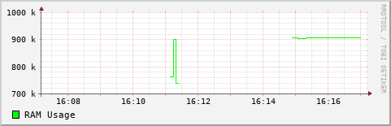
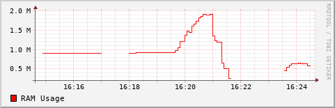

# Guida all'uso di RRD_usageMem_test

Benvenuto alla guida all'uso del progetto RAM Usage Monitor! Questo documento fornisce istruzioni dettagliate su come utilizzare il progetto per monitorare l'utilizzo della RAM e generare grafici con i dati archiviati nel database RRD.

## Panoramica

Il progetto RAM Usage Monitor è progettato per monitorare l'utilizzo della RAM su un sistema Linux utilizzando un database RRD (Round Robin Database) per archiviare i dati e generare grafici.

## Requisiti 🛠️

Prima di iniziare, assicurati di avere installato i seguenti requisiti:

- Ambiente linux
- RRDtool (Round Robin Database Tool) installato. (sudo apt install rrdtool)

## Installazione e Configurazione ⚙️

**Clona il repository**: Clona il repository RAM Usage Monitor dal repository GitHub utilizzando il seguente comando:
   
   ```
   git clone https://github.com/dadaynamo/RRD_usageMem_test.git
   ```
## Utilizzo 💻
**Crea il database RRD**: Avvia lo script `create_db.sh` per creare il database RRD per monitorare l'utilizzo della RAM.

```
./create_db.sh
```
Avvia lo script di aggiornamento: Avvia lo script update_ram_rrd.sh per aggiornare il database RRD con l'utilizzo corrente della RAM. Assicurati che lo script venga eseguito regolarmente per aggiornare i dati nel database.
```
./update_ram_rrd.sh
```
Controlla i valori nel database (facoltativo): Se desideri verificare che i valori siano stati correttamente aggiunti nel database, puoi utilizzare lo script check_db.sh.
```
./check_db.sh
```
Genera il grafico: Avvia lo script create_image.sh per generare il grafico dell'utilizzo della RAM basato sui dati archiviati nel database RRD.
```
./create_image.sh
```
## Esempi 📈

Di seguito sono mostrati due esempi di grafici generati utilizzando il progetto RAM Usage Monitor:

<p align="center">
  
</p>

<p align="center">
  
</p>


## Risoluzione dei Problemi ❗

Se incontri problemi durante l'utilizzo del progetto, assicurati di controllare i log di sistema per eventuali messaggi di errore e verifica che i requisiti siano stati soddisfatti correttamente.
Se gli script non vengono eseguiti, assicurarsi che si abbia i permessi di esecuzione su quei file .sh

## Contribuisci 🚀

Se desideri contribuire al progetto, puoi farlo aprendo una nuova issue o inviando una pull request su GitHub.

## Licenza 📄

Questo progetto è distribuito con licenza [MIT](LICENSE)
